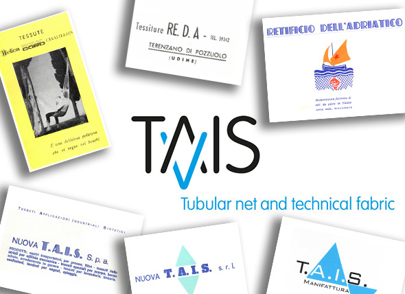
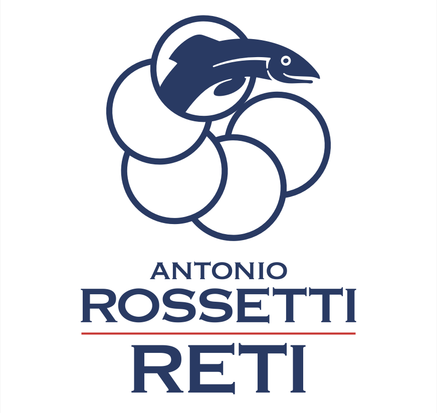
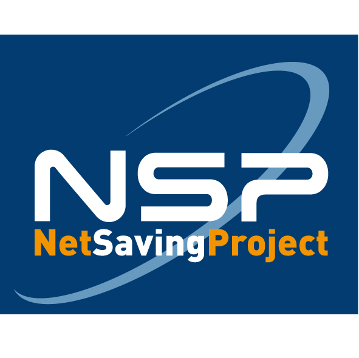

<!-- Sostituire il logo con "loghi-storia" -->
<!-- Nuovo testo di presentazione dell'azienda (dopo ns incontro) -->
<!-- Foto impianto /telaio tessile + Racconto x immagini di acronimo TAIS -->
<!-- Collezione suddivisa per "applicazioni industriali" (classificazione Techtextil) -->

:::{.column-page layout="[1,1]"}

  

# Manifattura tessile
[www.taisnet.com](http://www.taisnet.com/) | ***"We follow the net"***   
TAIS sviluppa e produce tessuti e tubolari a maglia in catena per applicazioni tecniche nei processi industriali e per uso quotidiano.
<!-- Produzione specializzata di reti tubolari realizzate con tecnologia Raschel ("maglieria in catena").   -->
<!-- Fornitura di tessuti tecnici ad alte prestazioni per applicazioni industriali, agricole e specialistiche. -->

:::

***
<!-- Nuovo testo di presentazione dell'azienda e del progetto NSP (dopo ns incontro) -->
<!-- Applicazioni /progetti /realizzazioni (ABB +Remtech Application +VolleyBall +Crab +CostalDefence...) -->

:::{.column-page layout="[1,1]" style="float:left;margin-left: auto;"}

  

# Produzione artigianale di reti

[www.rossettinet.com](http://www.rossettinet.com/)  | ***"Net passion since 1920"***   
<!-- Azienda leader nelle soluzioni basate su rete per ogni esigenza di contenimento, raccolta, separazione, movimentazione, protezione e design — con applicazioni nell’uso quotidiano e nei processi industriali. -->
<!-- Azienda leader nella produzione su misura di reti per contenimento, raccolta, separazione, movimentazione, protezione e progettazione.   -->
<!-- Applicazioni trasversali che spaziano dall’uso quotidiano, al design, ai processi industriali, con un approccio adattabile secondo le esigenze tecniche secifiche. -->
Soluzioni _taylor-made_ per la pesca, l’acquacoltura, la caccia, lo sport, e per applicazioni industriali.

:::

***
<!-- Nuovo testo di presentazione dell'azienda e del progetto NSP (dopo ns incontro) -->

:::{.column-page layout="[1,1]" style="float:left;margin-left: auto;"}

  

# Net Saving Project

***"Net Saving Project"***  
<!-- Nel 1986 abbiamo depositato il primo **brevetto per invenzione industriale**. -->
<!-- Nel 1986 abbiamo registrato il nostro primo [**brevetto per invenzione industriale**](images/Brevetto_NSP.pdf).   -->
<!-- Da allora sviluppiamo soluzioni tecniche sostenibili, con un focus su recupero, riuso e innovazione nel settore delle reti. -->
Nel 1986, Rossetti registrava il suo primo [**brevetto per invenzione industriale**](images/Brevetto_NSP.pdf).  
Da allora, sviluppa soluzioni tecniche sostenibili, con un focus su recupero, riuso e innovazione nel settore delle reti. 
:::
